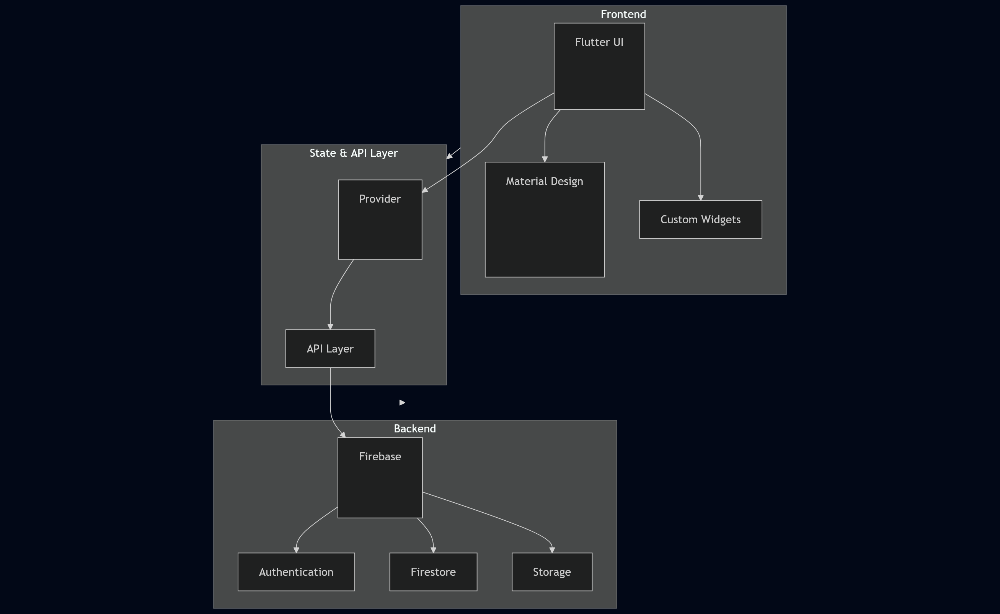

# TravelBuddy ✈️


TravelBuddy is a social app that helps users plan trips with others. Aside from being able to organize all your upcoming trips, you can also share these trips with others. Your unique travel styles and interests are accounted for, and the app connects you with like-minded travelers who share similar preferences.

This travel planning app is built with [Flutter](https://flutter.dev) for the frontend, utilizing [Firebase Authentication](https://firebase.google.com/docs/auth), [Cloud Firestore](https://firebase.google.com/docs/firestore), and [Firebase Storage](https://firebase.google.com/docs/storage) services for backend functionality. It demonstrates **CRUD operations**, **real-time data synchronization**, and modern UX principles through features like **QR code sharing**, **image handling**, and **location services**. [Material Design 3](https://m3.material.io) ensures the user-friendliness of the interface.



## Features 🚀

1. **Travel Plan Management**
Create detailed travel plans with a location that you can pick from **[Google Maps](https://developers.google.com/maps)**. Input a name, **start/end dates**, and optional details like flight information and accommodation. Add **cover images** and create day-by-day itineraries with checklists.

2. **Social Travel Sharing**
Share your travel plans with friends through username search or **[QR code](https://pub.dev/packages/qr_flutter)** scanning. The app ensures secure sharing by only allowing you to share with your friends. Manage shared access and remove users from your travel plans.

3. **Interactive Itinerary Planning**
Plan your trip day by day with customizable activities. Each day can have its own title, notes, and checklist items. Upload images for specific activities, and the app automatically generates the correct number of days based on your trip duration. All changes are synced in real-time for shared trips.

4. **Location-Based Features**
Find and select your travel destinations using **[Google Maps](https://developers.google.com/maps)** integration. The app provides location autocomplete with suggestions, making it easy to input accurate locations. Pick locations directly from the map, and the app validates and formats the addresses for consistency.

5. **User Profile & Preferences**
Customize your travel experience by setting your travel styles and preferences. Connect with friends, manage friend requests, and control your profile privacy. Your preferences are stored securely in **[Firebase](https://firebase.google.com)**, ensuring a personalized experience across all your devices.

## How to use the app 🤔

### Sign Up
1. Open the app and tap "Sign Up" or continue with Google.
2. Fill in the required details and create the account.

### Creating a Travel Plan
1. Tap the "+" button on the home screen
2. Fill in the basic details:
   - Trip name
   - Location (use the map picker or search)
   - Start and end dates
   - Check "One-day trip" if applicable
3. Add optional details:
   - Flight information
   - Accommodation details
   - Notes
4. Add a cover image (optional)
5. Tap "Save & Continue"

### Planning Your Itinerary
1. In your travel plan, go to the "Itineraries" tab
2. For each day, you can:
   - Add activities with titles and notes
   - Create checklists for each activity
   - Upload activity-specific images
   - Add custom days using the "+" button

### Sharing Your Travel Plan
1. In your travel plan, tap "Share"
2. Choose your sharing method:
   - Share by Username: Enter your friend's username
   - Generate QR Code: Let friends scan to join
3. Note: You can only share with friends
4. To remove someone from the plan:
   - Go to "Shared With" section
   - Tap the remove icon next to their name

### Managing Friends
1. Go to the Friends tab
2. To add friends:
   - Search for users by username
   - Send friend requests
   - Accept incoming requests
3. View friend profiles to see:
   - Their travel styles
   - Shared travel plans
   - Common interests

### Location Features
1. When adding a location:
   - Use the map picker for precise selection
   - Use autocomplete for quick search
   - View location on map
2. The app will:
   - Validate the location
   - Format the address
   - Store coordinates

## Running the app 🛠️

### Deployed
1. Simply visit this website: [TravelBuddy](https://travel-buddy-flutter.netlify.app/#/main).

### Locally
**Prerequisites**:
- [Flutter SDK](https://flutter.dev/docs/get-started/install)
- [Firebase Project](https://firebase.google.com/)
- A code editor like [VS Code](https://code.visualstudio.com/)

### Steps to Deploy Locally

1. **Prerequisites**
   - Install [Flutter](https://flutter.dev/docs/get-started/install) (latest stable version)
   - Install [Git](https://git-scm.com/downloads)
   - Install [Android Studio](https://developer.android.com/studio) or [Xcode](https://developer.apple.com/xcode/) (for iOS)
   - Install [Firebase CLI](https://firebase.google.com/docs/cli)

2. **Clone the Repository**
   ```bash
   git clone https://github.com/smmariquit/travelbuddy.git
   cd travelbuddy
   ```

3. **Install Dependencies**
   ```bash
   flutter pub get
   ```

4. **Set up Firebase**
   - Create a new Firebase project at [Firebase Console](https://console.firebase.google.com/)
   - Enable Authentication (Email/Password)
   - Set up Firestore Database
   - Set up Firebase Storage
   - Download `google-services.json` (Android) and/or `GoogleService-Info.plist` (iOS)
   - Place the configuration files in:
     - Android: `android/app/google-services.json`
     - iOS: `ios/Runner/GoogleService-Info.plist`

5. **Configure API Keys**
   - Get a Google Maps API key from [Google Cloud Console](https://console.cloud.google.com/)
   - Add the API key to:
     - Android: `android/app/src/main/AndroidManifest.xml`

6. **Run the App**
   ```bash
   flutter run  
   ```
---
## Folder Structure 📂
```
travelbuddy/
├── lib/                    # Main application code
│   ├── api/               # Backend service integrations
│   ├── models/            # Data structure definitions
│   ├── providers/         # State management
│   ├── screens/           # UI screens and pages
│   ├── utils/             # Helper functions and constants
│   └── widgets/           # Reusable UI components
├── android/               # Android-specific configurations
│   └── app/
│       └── src/
│           └── main/
│               └── AndroidManifest.xml
└── pubspec.yaml           #  Project dependencies and metadata (splash screen)
```
Created with https://ascii-tree-generator.com/

## Developers 👩‍💻👨‍💻👨‍💻

3Traveleers is a team of three second-year BS Computer Science students at UPLB
* Windee Rose De Ramos
* Simonee Ezekiel Mariquit - ([LinkedIn](https://linkedin.com/in/stimmie))
* Jason Duran
  
## References

### Core Technologies
* [Flutter Documentation](https://flutter.dev/docs)
* [Firebase Documentation](https://firebase.google.com/docs)
* [Material Design](https://m3.material.io/)
* [Dart Documentation](https://dart.dev/guides)
* [DartDoc](https://dart.dev/tools/dart-doc)

### Packages & APIs
* [Google Maps Web Services](https://pub.dev/packages/flutter_google_maps_webservices)
* [Firebase Auth](https://pub.dev/packages/firebase_auth)
* [Cloud Firestore](https://pub.dev/packages/cloud_firestore)
* [Firebase Storage](https://pub.dev/packages/firebase_storage)

### Flutter Widgets & Components
* [InkWell](https://api.flutter.dev/flutter/material/InkWell-class.html)
* [Card](https://api.flutter.dev/flutter/material/Card-class.html)
* [ClipRRect](https://api.flutter.dev/flutter/widgets/ClipRRect-class.html)
* [TextOverflow](https://api.flutter.dev/flutter/painting/TextOverflow.html)
* [Image Widget](https://api.flutter.dev/flutter/widgets/Image/Image.asset.html)
* [MediaQuery](https://api.flutter.dev/flutter/widgets/MediaQuery-class.html)

### Design Resources
* CMSC 23 Resources
* [Flutter Widget Catalog](https://flutter.dev/docs/development/ui/widgets)
* [pub.dev](https://pub.dev) - Flutter package repository
  
## Acknowledgements 🙏

* This project would not have been possible without the teaching committee of CMSC 23 for 2S 24-25 at UPLB.
* Sa mga patuloy na naghahanap ng kanilang landas, *padayon*
